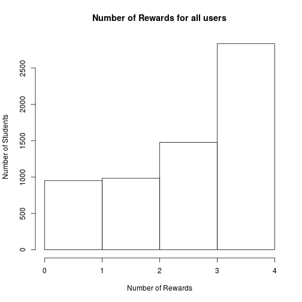
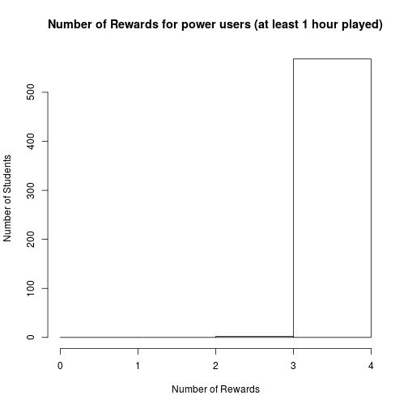

Analysing Award distribution among players
========================================================
author: Alexandre Russel
date: December 2015

Context
========================================================

The data we are analysing comes from an iOs app.

To keep player motivated, player can win rewards when they play well.

But if we give to many rewards too fast,
then the player looses motivation.

What is the repartition of Rewards ?
========================================================

The following graph shows how many player have how many 
rewards: 

 

What is the repartition of Rewards for power user ?
========================================================

The following graph shows how many player who played at least
one hour:

 

Conclusion
=========================================================
We can see from the previous slide that the vast majority
of power user have all rewards. This might make the game
not as interesting for them. We might want to increase the number
of rewards or making it more difficult to gain them.
